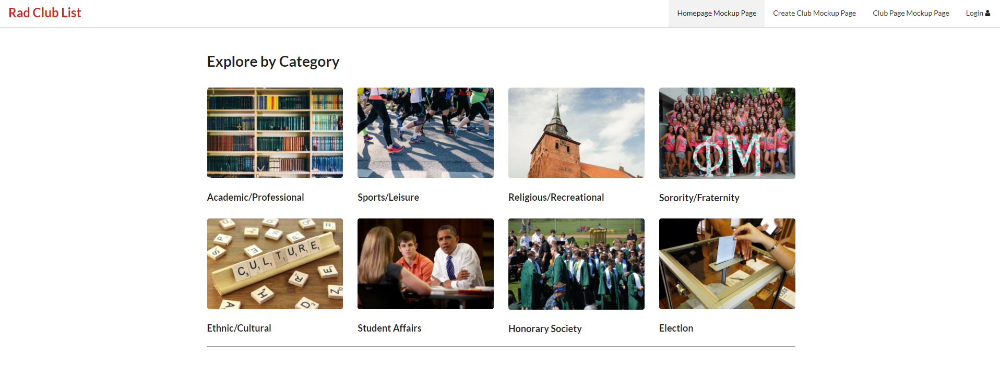
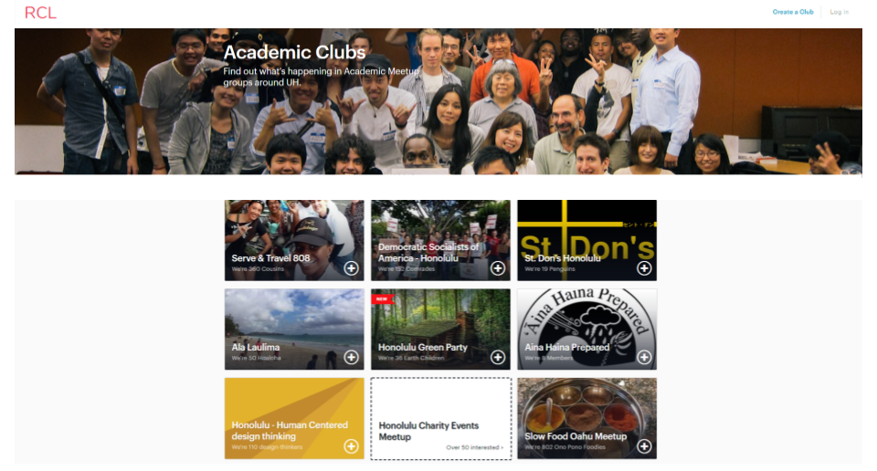

# Table of contents

* [About RCL808](#about-rcl808)
* [Installation](#installation)
* [Development](#development)

# About RCL808

[Link to Application Homepage](https://rcl808.meteorapp.com/)
[Link to Milestone 1](https://github.com/rcl808/rcl808/projects/1)
[Link to Milestone 2](https://github.com/rcl808/rcl808/projects/2)

RCL808 is a web application which offers a comprehensive listing of all clubs and organizations on the University of Hawaii at Manoa Campus.



The homepage of RCL808 features a top menu bar where users can login. In the main section of the page, several clubs will be featured using cards and popular categories are also listed with cards below. Users are also able to search for particular clubs and can create a club if they are logged in.


Users can navigate to The create a club page where users can obtain all of the documents to create a club at the University of Hawaii at Manoa. Once this club is registered, the website will be updated from the official club list.



Users can search for a club using the search menu. An alternative way to find clubs is to sort the clubs by category.


Once a user has found a club that they are interested in, users can navigate to the club's page and view information about the club.

# Installation

Installation of this application requires the meteor framework, npm and node.  

#### Installing meteor:  
```
choco install meteor
```
#### Updating NPM:
```
Set-ExecutionPolicy Unrestricted -Scope CurrentUser -Force
npm install -g npm-windows-upgrade
npm-windows-upgrade
```
#### Running the Application:
```
meteor npm install
meteor npm run start
```

# Development

#### Milestone 1:

The development of the application was based off a meteor application template react. Initial changes in milestone 1 conceptualizing the usage case of the application and the design of the main pages of the application. These pages were the homepage, create a club page, category page and individual club pages. Mockups of the pages were implemented in milestone 1 and contains the basic layout of the pages. Integration with the Mongodb database and other advanced features have not been implemented. These pages have been temporarily implemented in the NavBar to facilitate development and debugging.

Development progress of the application was maintained using GitHub's issue tracking and projects. All issues are based on self-imposed application and functional requirements. Issues were created and placed in the backlog category and are assigned and worked on in the in-progress category. All contributors to each issue are added to the assigned users. Issues are closed and moved to the completed category when requirements are met and implemented.

#### Milestone 1 Mockups:


