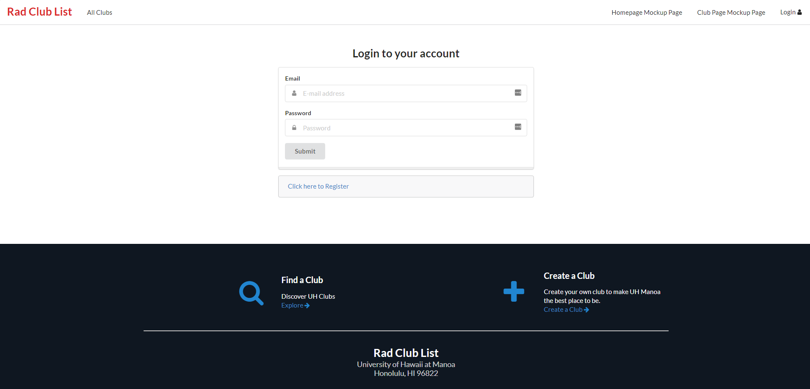
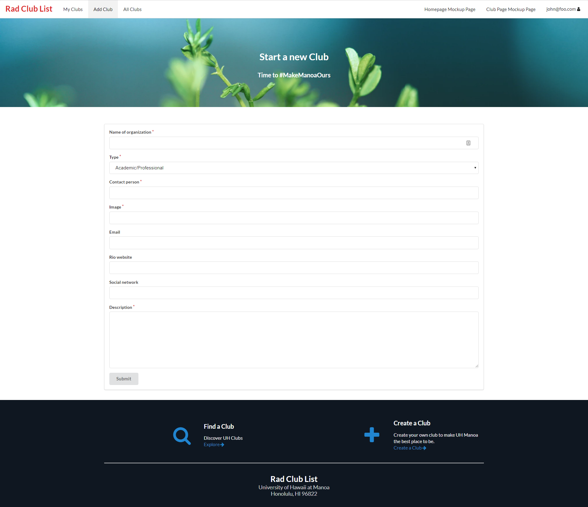

# Table of contents

* [About RCL808](#about-rcl808)
* [Installation](#installation)
* [Application design](#application-design)
  * [Directory structure](#directory-structure)
* [Development History](#development-history)
  * [Milestone 1](#milestone-1)
  * [Milestone 2](#milestone-2)
  * [Milestone 3](#milestone-3)


# Links
[Link to Webpage](https://rcl808.meteorapp.com/)  
[Link to GitHub Repository](https://github.com/rcl808/rcl808)  

# About RCL

Rad Club List (RCL) is a web application which offers a comprehensive listing of all clubs and organizations on the University of Hawaii at Manoa Campus. RCL only contains registered independent organizations (RIO) at the University of Hawaii at Manoa. Clubs are list by categories and contain information such as details about club activities, social media links, contact information and other information about the clubs. Users can create their own accounts and favorite and add themselves to organizations which they are a part of. Leaders of clubs will also have editing privileges to their own club and can modify their club pages.

# Application Walkthrough

#### Landing Page

When users first visit the website, they are first greeted by the landing page. If the user is not logged in, the user will be greeted by a login banner and an option to explore popular club categories.


The homepage of RCL808 features a top menu bar where users can login. In the main section of the page, several clubs will be featured using cards and popular categories are also listed with cards below. Users are also able to search for particular clubs and can create a club if they are logged in.


Users can navigate to The create a club page where users can obtain all of the documents to create a club at the University of Hawaii at Manoa. Once this club is registered, the website will be updated from the official club list.

Users can search for a club using the search menu. An alternative way to find clubs is to sort the clubs by category.


Once a user has found a club that they are interested in, users can navigate to the club's page and view information about the club.

# Installation

Installation of this application requires the meteor framework, npm and node.  

#### Installing meteor:  
```
choco install meteor
```
#### Updating NPM:
```
Set-ExecutionPolicy Unrestricted -Scope CurrentUser -Force
npm install -g npm-windows-upgrade
npm-windows-upgrade
```
#### Running the Application:
```
meteor npm install
meteor npm run start
```

# Application Design

## The backend structure

Our application is created by a combination of meteor, galaxy, and mlab. Galaxy and mlab are used to host and store database. Meteor is used as the main framework to build and design RCL808. The structure of the application is showned below:

```
client/
  main.html         # Contains the headings for the application and background color
  main.js           # Import all the files in this application for it to run smoothly
  style.css         # Front-end customizations

imports/
  api/              # Create schema for the database of the application
  startup/          # Contains the codes to run what the system starts
  ui/               # Contains all the codes for all the front-end component of the application
                    # to interaction with the users and with each other.

node_modules/       # Contains the roots of Meteor.

public/             # Contains all the images to be used on the front-end.
  images/
```

# Development History

## Milestone 1

Upon completing this milestone, there would be various mockup HTML pages to be used on our application.

Milestone 1 has a total of 10 issues. All of them are managed [here](https://github.com/rcl808/rcl808/projects/1)
Below is a screenshot of this milestone.


The issues are first created in the "Backlog" column. Each member chooses what he would like to work on by dragging the chosen issue into the "In Progress" column. Whenever the issue is resolved, the member can drag it to "Done" column and close it.

The html pages we created for this milestone are:

* Landing page


* Login page


* Create Club Page


## Milestone 2

Milestone 2 has a total of 8 issues. All of them are managed [here](https://github.com/rcl808/rcl808/projects/2).
Below is a screenshot of this milestone.


As for this milestone, we create an universal footer for users to easily access the main functionality of the application.

We also make the categories on landing page clickable

Improve user interface to make all the web pages consistent with the overall theme.

* Landing page


* Login page


* Sign up page


* Create Club page


## Milestone 3

Milestone 3 has a total of 8 issues. All of them are managed [here](https://github.com/rcl808/rcl808/projects/3).
Below is a screenshot of this milestone.


As for this milestone, the main goal is to add various functionalities into the application. The user can add their own club and be found within the clubs directory.

The user can choose clubs that he/she would like to know more. In case if he/she does not want to attend the club anymore, he/she can leave the club. All of these functionaries can be accessed under 'My Clubs' tab in the navbar.

On top of this, the users can find clubs based on the categories. In previous milestone, we were only able to make it clickable, but now it works the way it is supposed to. Once the user clicks on the category, it will lead him/her to the All Clubs page. It has a feature to sort out the clubs based on what is chosen. The image below illustrate how the function works.

* All Clubs page


## Initial User Testing

We allowed a few users to test the application. Then they gave their feedback on what they liked and what could be improved. These are their responses:

Kristen (24 yr old office worker):

*"Seems like a good site to search for what clubs there are at UH. It would be nice if there was more than just joining and leaving clubs though. Otherwise I wouldn't really use the site."*

Ryan (Sophomore major in Business)

*"I'd say you need something like a group chat or something, like a bulletin board for the clubs you're in. Also like a gallery showing past activities along with the description of the club. I like the front page though."*

Richard (UH Manoa Alumni)

*"I like the user interface, simple yet intuitive, a much better version than that UH currently have for the clubs."*
